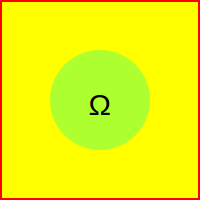

# Lecture 1
Probability is a mathematical framework for dealing with uncertainty (randomness). 
### What is Sample Space?
---
The set of all possible outcomes in an experiment. 
    
  >**Mutually Exclusive:** One outcome happening means others don't happen.

  >**Collectively Exhaustive:** The set includes all possible outcomes (at least one outcome must occur). 

* There can be numerous details in practical scenarios, what we consider relevant depends on our judgment, making it an art.
### When to choose sequential description?
---
Sequential Description is useful when the experiment has multiple stages (A tree-based).

* Sample space could be infinite. 

### What is an event?
---
The probability of hitting a specific point in this rectangle to infinite percision will be intuitively 0. (not helpful) So its better to assign probabilities to subsets of the sample space. So we can measure the probability of a event to occur or not. 

### AXIOMS
Ground rules that any legitimate probabilistic model should obey
1.  $P(A) \geq 0$ for all $A \subset S$ 
2.  $P(S) = 1$
3.  If $A \cap B = \emptyset$,
    then $P(A \cup B) = P(A) + P(B)$

* Another rule is probability stays between 0 & 1.

$$1^{(2)} = P(\Omega) = P(A \cup A^c)$$
$$^{(3)}P(A) + P(A^c)$$
$$P(A)= 1 - P(A^c)≤ 1$$

### The 3rd axiom for many (finite) sample space
P(AUBUC) = P((AUB)UC)= P(AUB)+P(C) = P(A)+P(B)+P(C)
### Task1

We have a sample space and we need to assign a probability law- We let every possible outcome have the probability of 1/16

* P({X=1}) = 4/16
* P(X+Y is odd)= 8/16
* P(min(X,Y)=2)=5/16

### Discrete Uniform Law
If all outcomes be equally likely 
P(A)= $\frac{Number of elements of A}{Total number of sample points}$

Computng probabilities = counting
This defines fair coins, fair dice, well shuffled decks 
### Continuous Uniform Law

Probability = Area
* P(X+Y ≤ 1/2) = 1/8
* P((X,Y)=(0.5,0.3))=0

# Lecture 2

### Concept of conditional probability
Info is always partial. 
random experiment → partial info → conditional probability
* The unit square is the union of one element set consisting of all the points. So the unit square is made up by the union of the various point inside the square

1= P(□) = P(U{(x, y)}) = Σ P ({x,y}) = Σ0 = 0

The third expression above isn't valid. It isn't a sequaence of sets; we can't exhaust the whole unit square by taking a sequence of elements inside it and cover the whole unit. Because infinite sets are not all of the same size. Continuous sets like the unit square is a bigger set (uncountable); having more sequence than any sequence could have.

* The 0 probalility means- its highly unlikely by itself. In such continuous probability models 0 probability outcomes are everything that happens. 

P((x, y) ≠ (0,0) = 1
* Probability of 1 means essential certainty it still allows the possibility that the outcome might be outside that set.
### Concept of conditional probability (Cont.)
Based on my knowledge of the world, we set up the probability model and we write down probabilities for the different outcomes.
New info → Changes belief (revising beliefs) → Conditional probabilities

  

    1/6
  

  

    3/6
    2/6
  

P(A|B) = probability of A, given B occurred
### Definition of Conditional Probability
P(B) = 0
P(A|B) = $\frac{P(A∩B)}{P(B)}$
P(A|B) undefined if P(B) = 0
#### Interpretetion in terms of frequency
P(A∩B) = P(B) P(A|B)

When the experment is done over and over again, what fraction of time it is going to be the case that both A and B occurs?
You only look at those experiments at which B happens to occur & what fractions of those experments where B already occurred, event A also occurs.

### Additivity Law
A∩B = ∅
P(A∩B|C) = P(A|C)+P(B|C)

  

  

  

  

  

  

  

  
  

  

  

  

  

  

  

  

  

X First roll
(By the Y axis, Y first roll)

* Let B be the event : min(X,Y)=2
* Let M = max(X, Y)
* P(M=1 | B) = 0
* P(M=2 | B) = $\frac{P(M=2 ∩ B)}{P(B)}$

Whenever w ehave a uiform distribution on out initial smaple space, when we condition a new event, our new distributon is still going to be uniform- but the smaller event of that we considered. 
### The model in terms of conditional probabilities
P((A∩B) P(C|A∩B)) = P(A∩B) P(C|A∩B) = P(A) P(B|A) P(C|A∩B)

### Total Probability Theorem
* divide & conquer
Partition of sample sapce into A1, A2, A3

  

  

  

  

we imagine 3 areas here A1, A2, A3

## Bayes' Theorem Statement

Let $E_1, E_2, ..., E_n$ be a set of events associated with a sample space $S$, where all the events $E_1, E_2, ..., E_n$ have nonzero probability of occurrence and they form a partition of S. Let A be any event associated with S, then according to Bayes theorem,
for any $k = 1, 2, 3,...., n$

## Venn Diagram Representation

$$P(E_i | A) = \frac{P(E_i)P(A | E_i)}{\sum_{k=1}^{n} P(E_k)P(A | E_k)}$$

# Lecture 3
Bayes' rule is the trivial half line calculation. 
### Inference
A situation on which there's a bunch or lots of different hypotheses about the environment. Given any parrticular setting in the environment, I may have a measuring device that may produce many different outcomes. I can observe the final outcome with my measuring device, trying to guess which particular branch occurred. Trying to guess the state of the world with paricular measurement.

### Property Independence
Two events are independent if and only if their probability of happening simultaneously is the equal of the product of their two individual probabilities.

* Independer is something we can check formally using these definition, but also we can check intuitivelyby if, in some casesyou can reason that whatever happens, that determines A is going to occur, or not, has absolitely nothing to do with whatever happens that determines whether B is going to happen or not.

* What events happen in one experiment aren't going to change our beliefs about what might be happeningin the other, because the sources of noise in these two experiments are completely unrelevant.
### Extreme dependence disjointness

    
A

    
B

These two circles as events, are seemingly different, as they are seperate, but aren't. Info about the occurrance of A in the sample space definitely affects our beliefs on possible occurance/non-occurance of B.
If A=1/3 & B=1/4
& P(A⋂B)=0
P(A) P(B)= 1/12
& P(A|B) = 0
P(A)=1/3
### Conditional Independence
Independence defined 
P(A⋂B)=P(A) P(B)
In conditional independence
P(A⋂B|C)=P(A|C) P(B|C)
This is the definition of conditional independence.

* In a particular experiment, where A & B are independent (A⋂B≠0), and C occurred, such that C has both some parts of A & B both included. 
Here A & B both are independent and disjoint. But the info that C occurrs biases the conception in such a way that in the new model, A and B are dependent.
"Having independence in the original model doesn't imply independence in conditional model"
# Lecture 4
Counting method apply in the situations in which we have probabilistic experiments with a fintie number of outcomes- where every possible outcome of the same possibility of occurring.

(Ω is the whole sample space, the circle is the A)
Ω has got a bunch of discrete points inside- the cardinality of set omega is N. The sample points are equally likely (P=1/N)
### Common trick of counting
When we consider a set with possible outcome, to describe the construction of those possible outcomes through a sequential process. 

We think of a probabilistic experiment that involves a number of stages, and in each stages there are a number of possible choices that there may be. The overall experiment consists of carrying out all the stages to the end. 
The number of possible leaves we have here is 4×3×2=24

  
Start

  

    

      
Branch 1

      

        

          
Sub-branch 1.1

          

            

              
Leaf 1.1.1

            

            

              
Leaf 1.1.2

            

          

        

        

          
Sub-branch 1.2

          

            

              
Leaf 1.2.1

            

            

              
Leaf 1.2.2

            

          

        

        

          
Sub-branch 1.3

          

            

              
Leaf 1.3.1

            

            

              
Leaf 1.3.2

            

          

        

      

    

    

      
Branch 2

      

        

          
Sub-branch 2.1

          

            

              
Leaf 2.1.1

            

            

              
Leaf 2.1.2

            

          

        

        

          
Sub-branch 2.2

          

            

              
Leaf 2.2.1

            

            

              
Leaf 2.2.2

            

          

        

        

          
Sub-branch 2.3

          

            

              
Leaf 2.3.1

            

            

              
Leaf 2.3.2

            

          

        

      

    

    

      
Branch 3

      

        

          
Sub-branch 3.1

          

            

              
Leaf 3.1.1

            

            

              
Leaf 3.1.2

            

          

        

        

          
Sub-branch 3.2

          

            

              
Leaf 3.2.1

            

            

              
Leaf 3.2.2

            

          

        

        

          
Sub-branch 3.3

          

            

              
Leaf 3.3.1

            

            

              
Leaf 3.3.2

            

          

        

      

    

    

      
Branch 4

      

        

          
Sub-branch 4.1

          

            

              
Leaf 4.1.1

            

            

              
Leaf 4.1.2

            

          

        

        

          
Sub-branch 4.2

          

            

              
Leaf 4.2.1

            

            

              
Leaf 4.2.2

            

          

        

        

          
Sub-branch 4.3

          

            

              
Leaf 4.3.1

            

            

              
Leaf 4.3.2

            

          

        

      

    

  

The total number of possible outcomes we have here is 4×3×2=24

### an example
We are given a set that consists of n elements; we are supposed to take them for putting them in a sequence.
n! is the number of permutations of n objets- the number of ways that one can order n objects that are given to you. 
* number of subsets for n elements is $2^n$
(each time we have the choice of putting it in the sequence or not)
### Axiom 1
Grounf rules that any legitimate probabilistic model should obey
1. Non-negativity: P(A)≥0
2. Normalization: P(Ω)=1
3. A∩B

## Counting

It helps us solve problems by figuring out how many ways we can arrange or choose things. This is crucial for understanding probability because many probability problems come down to counting the number of favorable outcomes and the total number of outcomes.

* having a probabilistic experiment with a finite number of outcomes, each equally likely. For example, rolling a fair die 6 times. The number of possible outcomes is calculated by raising the number of choices per roll to the power of the number of rolls:
\[
\text{Total Outcomes} = 6^6
\]

This formula works because each roll is independent of the others. So, the total number of outcomes is simply the product of choices for each stage.

### The Multiplication Principle

having multiple stages in an experiment, where each stage has a number of possible choices, the total number of outcomes is the product of the choices for each stage. 

**Example:** If you’re choosing a dish from a menu with 4 appetizers and 3 main courses, the number of possible meals is:
\[
4 \text{ (appetizers)} \times 3 \text{ (main courses)} = 12
\]

## Permutations:

When we need to arrange items in a specific order, we use permutations. 
How many different ways can we arrange 3 books on a shelf?
For each position, you have a choice of books:
- First position: 3 choices
- Second position: 2 remaining choices
- Third position: 1 choice left

 the total number of arrangements is:
\[
3! = 3 \times 2 \times 1 = 6
\]

## Combinations:

When the order doesn’t matter, we use combinations. For example, choosing 2 ice cream flavors from a list of 5. To find the number of ways to choose \(k\) items from \(n\) items, we use the combination formula:
\[
\text{Number of combinations} = \frac{n!}{k! \cdot (n - k)!}
\]

## Counting Subsets

If we have a set with \(n\) elements, the number of possible subsets is:
\[
2^n
\]

Why? For each element, we have two choices: include it in a subset or not. So, with \(n\) elements, you have \(2^n\) possible subsets.

## Understanding Special Cases

- **Subsets with Exact Number of Elements:**
  If you want to count subsets of exactly \(k\) elements from \(n\) elements, use the binomial coefficient:
  \[
  \binom{n}{k} = \frac{n!}{k! \cdot (n - k)!}
  \]

  **Example:** Choosing 3 people from a group of 10 to form a committee:
  \[
  \binom{10}{3} = \frac{10!}{3! \cdot (10 - 3)!} = 120
  \]

- **Extreme Cases:**
  For \(k = n\), you’re choosing all elements, so there's only one way to do it. Mathematically, this checks out with:
  \[
  \binom{n}{n} = 1
  \]

  Similarly, \(\binom{n}{0} = 1\) because there’s exactly one way to choose zero items (the empty set).

# Lecture 5
## Defining Random Variables
Random variables allow us to assign numerical values to the outcomes of an experiment, giving us a more tangible way to analyze and understand randomness. An experiment where we measure the height of a randomly chosen student from a class,the sample space \( \Omega \), is the set of all students in the class. A RV in this case,\( H \) for height—maps each student (an outcome) to a specific numerical value (their height in inches).

A random variable is a function that assigns a real number to every possible outcome of an experiment. 

## Types of Random Variables

A discrete random variable takes on a finite or countable number of possible values. For example, if we round a student’s height to the nearest inch, the random variable could only take integer values like 60, 61, 62, etc.On the other hand, a continuous random variable can take any value within a certain range. If we measure a student's height with infinite precision, the height could be any real number, making it a continuous random variable.

## Probability Mass Function (PMF)
The PMF assigns probabilities to each possible value that a discrete random variable can take; essentially, how likely each numerical outcome is. Example: flipping a coin until we get heads. Here, our random variable \( X \) might represent the number of tosses required to get the first head. If the first toss is a head, \( X = 1 \). If the first toss is a tail and the second is a head, \( X = 2 \). The PMF of \( X \) would then give the probabilities of these different values of \( X \).
The probability mass function is defined as:
\[
P_X(k) = P(X = k)
\]
 \( P_X(k) \) is the probability that the random variable \( X \) taking the value \( k \). The PMF must satisfy two conditions:
1. **Non-negativity**: \( P_X(k) \geq 0 \) for all \( k \).
2. **Normalization**: The sum of all probabilities must equal 1, \( \sum P_X(k) = 1 \).
## Examples of PMFs
We flip a fair coin until you get heads for the first time. If the number of tosses required to get the first head can be modeled as a geometric random variable, the PMF of this random variable \( X \) . Here \( X = k \) represents the event that the first head appears on the \( k \)-th toss, is given by:
\[
P_X(k) = (1 - p)^{k-1} p
\]
\( p \) is the probability of getting heads on a single toss.

\( (1 - p)^{k-1} \) represents the probability of getting \( k-1 \) tails before the first head.

For plotting this PMF, we'd notice that each successive bar (representing the probability of each value of \( X \)) gets smaller, creating a characteristic geometric decay. That's why it is called a geometric distribution.

## Random Variables as Functions

Random variables are essentially functions from the sample space to the real numbers. If \( H \) is the height of a student, it is a function that takes a student (an element of the sample space) and returns their height (a real number). Moreover, we can have functions of random variables that are also random variables. taking anexample, if we define a new random variable \( H' = H \times 2.54 \), which converts height from inches to centimeters, \( H' \) is a function of \( H \). Since \( H' \) still maps outcomes to real numbers, it is itself a random variable.

## Expected Value and Variance
The expected value or mean of a random variable gives a measure of the "center" or "average" value that the random variable takes on. Discrete random variable \( X \) with PMF \( P_X(k) \), the expected value \( E(X) \):
\[
E(X) = \sum_{k} k \cdot P_X(k)
\]
The variance of a random variable, on the other hand, measures the spread or "dispersion" of its possible values. It tells us how much the values of the random variable deviate from the mean. For a discrete random variable \( X \), the variance \( Var(X) \) is defined as:

\[
Var(X) = E[(X - E(X))^2] = \sum_{k} (k - E(X))^2 \cdot P_X(k)
\]
### Understanding Variance
1. Definition
Variance is a key statistical concept that measures how much the values of a random variable differ from its average value, or mean.
\[ \text{Var}(X) = E[(X - E[X])^2] \]
Think of variance as a measure of the spread of your data:
The example says having test scores that are very close to the average score, the variance will be low. Meaning the scores are not very spread out (consistent).By squaring the differences from the mean, variance gives more weight to larger deviations. So, if some test scores are very high or very low compared to the average, these will contribute more to the variance.
**2,Calculation:**
- **Random Variable Inside**: When you compute \( (X - E[X]) \), this result is still random because \( X \) is random, though \( E[X] \) is a constant.
- **Squared Deviation**: Squaring \( (X - E[X]) \) gives us a new random variable, which tells us the squared distance of each score from the mean. This random variable helps us understand how spread out the scores are.
* **Why Square the Deviations?**
* Squaring the deviations avoids the issue of positive and negative values canceling each other out. Without squaring them, the deviations might sum up to zero even if there is significant spread.
* By squaring, larger deviations from the mean have a disproportionately larger impact on the variance. This makes variance a useful measure for understanding how spread out or dispersed the values are.
Variance can also be computed using:

\[ \text{Var}(X) = E[X^2] - (E[X])^2 \]
here
- **\( E[X^2] \)**= This is the expected value of the square of \( X \). It represents the average of the squared values of the random variable.
- **\( (E[X])^2 \)**= This is the square of the mean of \( X \).
expanding the squared deviation formula:
\[ E[(X - E[X])^2] = E[X^2] - 2E[X]E[X] + (E[X])^2 \]
\[ \text{Var}(X) = E[X^2] - (E[X])^2 \]
### Importance of Variance
It provides a measure of how consistent or variable the data is. A high variance indicates a lot of variability, meaning the data points are spread out widely around the mean. A low variance indicates that the data points are clustered closely around the mean. Knowing the variance helps in assessing how predictable the data is. Lower variance means more predictability and stability, whereas higher variance suggests greater uncertainty.

# Lecture 6

## Random Variables and Expectations

## Random Variables

Random variables are like tools we use to assign numerical values to the outcomes of random experiments. For example, if we flip a coin, the result (heads or tails) is uncertain, but we can assign a numerical value to each outcome—let’s say 1 for heads and 0 for tails. In this way, the random variable translates the uncertain outcomes into numbers we can work with.

## Expectations and Expected Values

This isthe average value you would expect if you could repeat the experiment an infinite number of times.

### Expected Value

The **expected value** of a random variable is a weighted average of all possible values, where each value is weighted by its probability. Mathematically, it’s defined as:

\[ E(X) = \sum_{x} x \cdot P(X = x) \]

example: rolling a fair six-sided dice. The possible outcomes are 1 through 6. The expected value is:

\[ E(X) = \frac{1}{6}(1 + 2 + 3 + 4 + 5 + 6) = 3.5 \]

if we roll the dice quite a few time, the mean will be near 3.5.

## Functions of Random Variables

A random variable's \( X \) function \( g(X) \) is also a random variable. \( X \) represents the roll of a die and \( g(X) \) is the square of \( X \), then \( g(X) \) will be the square of the result of the die roll.

\[ E(g(X)) = \sum_{x} g(x) \cdot P(X = x) \]

shortcut:We can directly use the PMF of \( X \) to compute \( E(g(X)) \).

## Linearity of Expectation

If \( g \) is a linear function, the expectation behaves linearity:

\[ E(aX + b) = aE(X) + b \] in this way
## Variance and Standard Deviation
While the expected value gives us a central tendency, it doesn’t tell us how spread out the values are. To do this, we use **variance**. The variance is the average squared distance from the mean:

\[ \text{Var}(X) = E[(X - E(X))^2] \]

Variance has units that are the square of the units of \( X \).To get a more interpretable measure of spread, we use the standard deviation, which is the square root of the variance. It’s expressed in the same units as \( X \) and provides a clearer picture of the distribution's spread.
## Example1
We takea simple experiment where the distnce is 200 miles.we can either fly at 200 miles per hour or walk at 1 mile per hour. We flip a coin to decide which speed you’ll use. Let’s denote the speed by \( V \), and the time by \( T \). 

- With probability \( \frac{1}{2} \), \( V = 200 \) mph, and the time \( T \) is \( \frac{200}{200} = 1 \) hour.
- With probability \( \frac{1}{2} \), \( V = 1 \) mph, and the time \( T \) is \( \frac{200}{1} = 200 \) hours.

**Expected Speed**:
\[ E(V) = \frac{1}{2}(200) + \frac{1}{2}(1) = 100.5 \text{ mph} \]

**Variance of Speed**:
\[ \text{Var}(V) = \frac{1}{2} (200 - 100.5)^2 + \frac{1}{2} (1 - 100.5)^2 \approx 10000 \text{ (mph)}^2 \]

**Standard Deviation**:
\[ \text{SD}(V) = \sqrt{10000} = 100 \text{ mph} \]

**Expected Time**:
\[ E(T) = \frac{1}{2}(200) + \frac{1}{2}(1) = 100.5 \text{ hours} \]

Interestingly, the expected value of the product \( T \times V \) (which is always 200) is not the same as the product of their expected values (which is \( 100.5 \times 100.5 \)).

## Conditional Expectations

When we have new information, like knowing that a specific event has occurred, we use **conditional expectations**. For example, if we know \( X \) is greater than or equal to 2, we update our probabilities and expectations based on this new information.

The **conditional expectation** of \( X \) given an event \( A \) is:

\[ E(X | A) = \frac{\sum_{x \in A} x \cdot P(X = x | A)}{\sum_{x \in A} P(X = x | A)} \]

In the example where \( X \) was initially uniformly distributed, if we know \( X \geq 2 \), we conditionally update our PMF so that the probabilities of 2, 3, and 4 are each \( \frac{1}{3} \). The conditional expectation in this case would be 3.
# Lecture 7
* The Case of Three random variables
$P_{x,y,z}(x, y, z)$ 

This shows the probability that X takes the value, Y takes the value,  Z takes the value, simultaneously.

# Lecture 7

The joint PMF of two random variables gives us the probability of any pair of possible values of those variables occurring simultaneously.

Pₓ(x) = P(X=x) --> marginal  
Pₓᵧ(x,y) = P(X=x, Y=y) --> joint

* For the conditional PMF (a list of various conditions of conditional probabilities of interest):

Pₓ|ᵧ(x|y) = P(X=x | Y=y) --> conditional

* The probabilities of all x's need to add up to 1. So,

Σₓ Pₓ|ᵧ(x|y) = 1

[Hence, they are essentially like ordinary probabilities over the different x's in a universe where we know the value of y (random variable).]

> Joint to Marginal:

Pₓ(x) = Σᵧ Pₓᵧ(x,y)

> Conditional and Marginal to Joint:

Pₓᵧ(x,y) = Pₓ(x) Pᵧ|ₓ(y|x)

This resembles:

P(A∩B) = P(A) P(B|A)

Where:

- A = event where X takes value x
- B = event where Y takes value y
- Joint probability of A & B happening simultaneously.

**In case of 3 random variables (r.v.)**

Pₓᵧz(x,y,z) = P(x,y,z)

Pₓ(x) = ∑ᵧ,z Pₓᵧz(x,y,z)

[Fixing x and considering all the possible variables for the remaining y & z]

**Independent Random Variables**

Pₓᵧz(x,y,z) = Pₓ(x) Pᵧ|ₓ(y|x) Pz|ₓ,ᵧ(z|x,y)

We know it before like this:

P(A∩B∩C) = P(A) ⋅ P(B|A) ⋅ P(C|A,B)

* Three random variables are independent if and only if their joint probability mass function factors into the product of their individual probability mass functions:

Pₓᵧz(x,y,z) = Pₓ(x) ⋅ Pᵧ(y) ⋅ Pz(z)

* Random variables are independent if and only if knowing the realized values of some of these random variables doesn't change our beliefs about the likelihood of various values for the remaining random variables.

Thus, Pₓ|ᵧ(x|y) = Pₓ(x)

This means we have some original beliefs about how likely it is for X to take on certain values.

Now, if the information comes that Y took on a certain value, it would compel us to revise our beliefs, which is represented by Pₓ|ᵧ(x|y).

Independence means that our new revised beliefs will be the same as the original belief.

This conditional is only well-defined if the event that \(Y\) takes on that particular value has a positive probability. (\(Pᵧ(y) > 0\)). Thus, we can't condition on zero probabilities.

→ Similarly, for multiple random variables (r.v.):

Pₓ|ᵧ,z(x|y, z) = Pₓ(x)

**Example 1:**

Two discrete random variables:

|   y\x   | 1/20 | 2/20 | 1/20 |        |
|:-------:|:----:|:----:|:----:|:------:|
| **4**   | 2/20 | 2/20 |      | 2/20   |
| **3**   | 3/20 | 4/20 | 1/20 | 2/20   |
| **2**   | 1/20 | 2/20 | 1/20 |        |
| **1**   | 1/20 |      |      |        |

Table: Joint PMF table.

- **Independent?**
Fixing the value of \(y\) each time changes what we expect or consider possible for the values of the other random variable.
